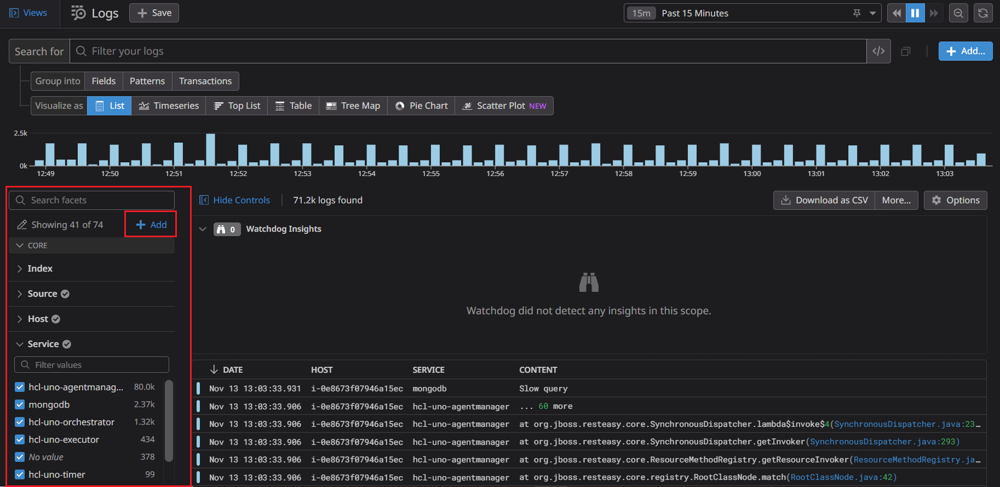
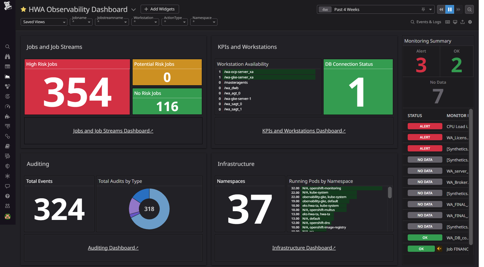
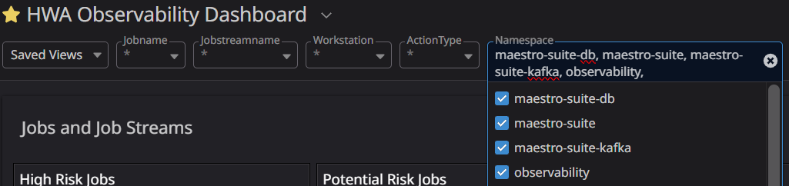

# HCL Workload Automation Observability for Datadog

You can use HCL Workload Automation (HWA) Observability for Datadog to monitor HCL Workload Automation metrics, events, audit and infrastructure logs.

## Content
- [HCL Workload Automation Observability for Datadog](#hcl-workload-automation-observability-for-datadog)
  - [Content](#content)
  - [Prerequisites](#prerequisites)
  - [Language support](#language-support)
  - [Installation](#installation)
    - [1. Installing and configuring Datadog](#1-installing-and-configuring-datadog)
    - [2. Datadog installation](#2-datadog-installation)
    - [3. Forwarding Logs to Datadog](#3-forwarding-logs-to-datadog)
    - [4. Forwarding Metrics to Datadog](#4-forwarding-metrics-to-datadog)
  - [WA Monitoring Dashboards and Alerts setup in Datadog](#wa-monitoring-dashboards-and-alerts-setup-in-datadog)
    - [1. Create Log Facets](#1-create-log-facets)
    - [2. Create Dashboards and Monitors](#2-create-dashboards-and-monitors)
    - [3. Configuring dashboard markdown link](#3-configuring-dashboard-markdown-link)
  - [Getting Started with Workload Automation Monitoring](#getting-started-with-workload-automation-monitoring)
  - [FAQs](#faqs)

## Prerequisites
Following prerequisites must be satisfied prior to deploy the Datadog solution: 
- Kubernetes cluster (OCP V4.7 or above, GKE) with administrative access
- HWA v10.x installed on the Kubernetes cluster 
- Tools & Packages 
  - Datadog Agent v7 and Datadog release 3.3.1

Note: To use the HWA Observability Dashboard for Datadog, HWA metrics must be available. For information about HWA exposed metrics, see [Exposing metrics to monitor your workload](https://help.hcltechsw.com/workloadautomation/v102/distr/src_ref/awsrgmonprom.html).

## Language support
For the dashboards provided with HWA Observability for Datadog, the only supported language is English. 

## Installation


### 1. Installing and configuring Datadog
1. From [HCL License Portal](https://id.hcltechsw.com/login/login.htm) download the appropriate HWA Observability installation package:
   HWA Observability for HWA Observability Add-on
2. Installation package for Datadog: HWA_OBSERVABILITY_APP_FOR_DATADOG_10.x.tar.gz
3. Follow the below command to untar the gzip file 
  
  ```

	tar -xvzf HWA_OBSERVABILITY_APP_FOR_DATADOG_10.x.tar.gz
  ```

4. Follow the steps mentioned in this ReadMe file to continue the solution setup.

### 2. Datadog installation

1. To install the Datadog agent on your cluster, follow this procedure: [Datadog Agent on Kubernetes](https://docs.datadoghq.com/containers/guide/kubernetes_daemonset/).
2. At step 2, download this [datadog-agent-all-features.yaml](https://github.com/DataDog/documentation/blob/ec93cab1dec4f642a45bb712c3f3d690f096ffe0/static/resources/yaml/datadog-agent-all-features.yaml) file.Then rename the file to datadog-agent.yaml.
3. Continue with the installation steps 3 and 4.
4. At step 5, if your Datadog site to datadoghq.com, skip this step, otherwise set DD_SITE based on your Datadog website URL.

    Follow this [documentation site selector](https://docs.datadoghq.com/getting_started/site/#access-the-datadog-site) and select the site parameter based on your Datadog website URL.

    Look at this command below as an example.
    ```
     - name: DD_SITE
       value: "{ADD_SITE_PARAMETER}"
    ```
      Inside its manifest daemonset.yaml, add the following environment variable for all containers.

5. Before executing step 6, configure your YAML file for Forwarding metrics and logs steps as mentioned below.

### 3. Forwarding Logs to Datadog

Inside daemonset.yaml, add the following environment variable for all containers (agent, trace-agent,process-agent,system-probe,security-agent ).

```
- name: DD_CONTAINER_INCLUDE_LOGS
  value: "name:waserver-plan-auditing name:waserver-db-auditing name:waserver-bm-events"
- name: DD_CONTAINER_EXCLUDE_LOGS
  value: "name:.* image:.*"
```
For Openshift installation, inside its manifest daemonset.yaml, add the following environment variable for all containers (agent, trace-agent,process-agent,system-probe,security-agent ).
```
 - name: DD_KUBELET_TLS_VERIFY
   value: "false"
  ```
### 4. Forwarding Metrics to Datadog

Inside its manifest cluster-agent-deployment.yaml, add the following to annotations for the Cluster Agent:
```
      annotations:
        ad.datadoghq.com/cluster-agent.checks: |
          { "openmetrics": { "init_config": {}, 
          "instances": [ {
          "openmetrics_endpoint": "https://%%host%%:%%port%%/metrics",
          "tls_verify":"false",
          "namespace": "hwa_metrics",
          "metrics": [".*"] 
          } ] } }        
```
Replace openmetrics_endpoint host and port with your respective metrics endpoint host and port.

Note: Add property "tls_verify":"false" for not certified or unsecure metrics endpoint.

Inside its manifest cluster-agent-deployment.yaml, add the following environment variables for the Cluster Agent container:

```
- name: DD_PROMETHEUS_SCRAPE_ENABLED
  value: "true"
- name: DD_PROMETHEUS_SCRAPE_SERVICE_ENDPOINTS
  value: "true" 
```
After you have configured your YAML file, continue with steps 6 and 7 mentioned in the procedure: [Datadog Agent on Kubernetes](https://docs.datadoghq.com/containers/guide/kubernetes_daemonset/).

Note : For Openshift installation follow the same steps and replace kubectl with oc commands.

## WA Monitoring Dashboards and Alerts setup in Datadog

### 1. Create Log Facets


In the Logs page > Search , create a new facet directly from the facet panel using the add facet button and create Log facets for the below attributes.
| Attributes	|
| ------ | 
| @actionType	|
| @auditType	|
| @userName	|
| @workstationName	|
| @objectType	|
| @event	|
| @returnCode	|
| @jobName	|

### 2. Create Dashboards and Monitors
Run the starter.sh with your DD_HOST_PATH, DD_API_KEY, DD_APP_KEY as parameters. 

```
 $ sh ./starter.sh DD_HOST_PATH DD_API_KEY DD_APP_KEY 
```

Look at this command below as an example.

```
 $ sh ./starter.sh  https://api.datadoghq.com 934ac4513XXXXXXX 0efa7dc64XXXXXXX 
```

### 3. Configuring dashboard markdown link

The HWA Observability Overview Dashboard​ provides links to all dashboards. Once the dashboard is created, a new dashboard id is generated for each and every dashboard. So every dashboard id needs to be updated on the HWA Observability Dashboard​ markdown component.


1. In Dashboard List, open each and every dashboard in a new window and copy the dashboard URLs.
2. Select HWA Observability Dashboard.
3. Edit all markdown components as mentioned above.
4. Replace your respective dashboard URLs with markdown field. 

## Getting Started with Workload Automation Monitoring     

The WA Monitoring Overview Dashboard provides a single, consolidated view for monitoring the workload status. By selecting a dashboard on the list, you can see the information related to that dashboard. 

**WA Monitoring overview Dashboard** 

In the WA Monitoring Overview Dashboard, you can view the whole status of your workload at a glance for one or more of the engines you have configured.  

**Overview Dashboard:** 
 

By clicking a button or menu option, you open a new tab displaying the selected dashboard information. The following dashboards are supported: 

- **Jobs and Job Streams Dashboard**. This dashboard shows the status of Jobs, Critical Jobs and Job Streams. 

  Source of Information: WA Deployment events sidecar container and WA server Logs.

- **KPIs and Workstations Dashboard**. This dashboard shows the Workload Automation KPIs information for each host and allows drilldown to see the timeseries data in visual representation for defined KPIs.

  Source of Information: API exposed by WA Server on port 31116.
   
- **Auditing Dashboard**. This dashboard shows details of workstations and audit information such as user actions. Users can view audit information for selected time range, user and object. 

  Source of Information:  WA Deployment sidecar audit containers, for example: waserver-db-auditing, waserver-plan-auditing etc. 

- **Infrastructure Dashboard**. This dashboard provides an overview of the infrastructure details of Workload Automation deployed on Kubernetes cluster. 

  Source of Information: Infrastructure Logs exposed by Openshift cluster. 

- **Monitors**: Monitors are created out of HWA Monitoring Application. Follow this [Monitors](https://docs.datadoghq.com/monitors/) documentation to create your monitors and alerts. The following table shows some of the out-of-the-box monitors that come with the HWA Observability Dashboard:

| Monitors	 | Threshold Condition | Priority |
| ------ | ------ | ------ | 
| WA_Broker_Status	 | ==0 (more than 5 minutes ) | Critical |
| WA_DB_connected  |	==0 (more than 1 minutes  ) | Critical |
| WA_FINAL_Error  |	==1 (more than 1 minutes  ) | Critical |
| WA_FINAL_Late  |	==1 (more than 1 minutes  ) | Critical | 
| WA_LicenseUncounted  |	> 0 (more than 1day) | Critical |
| WA_Server_link_status  |	==0 (more than 5 minutes  ) | Critical |

## FAQs


1. Q. How many dashboards are available with HCL Workload Automation Observability for Datadog?

   A. You can import and use the following 5 dashboards:
    - HWA Observability Dashboard​ (Overview Dashboard)
    - Jobs and Job Streams Dashboard
    - KPIs and Workstations Dashboard
    - Auditing Dashboard
    - Infrastructure Dashboard
 
2. Q. How to apply Dark theme to Datadog dashboards?

   A. View Datadog dashboards in dark mode by hovering over your avatar in the sidebar, or by pressing Ctrl+Opt+D / Ctrl+Alt+D.
    
3. Q. Which version of Datadog is supported?

   A. The solution supports and was verified on Datadog Agent v7 and Datadog release 3.3.1.
    
4. Q.How to save the filter history?

   A.Add your filter keys and select "save select view as". Then, add the view name. 

5. Q. How to collect metrics from non certified or unsecure metrics endpoint?

   A.  Add property "tls_verify":"false" to the metric instances.

6. Q. How to create Application Key (DD_APP_KEY) ?

   A.To add a Datadog application key:
    
    - In your Profile , Navigate to Organization Settings > Application Keys.
    - If you have the permission to create application keys, click New Key.

   Notes: Application key names cannot be blank.

7. Q. How to create API key (DD_API_KEY) ?

   A.To add a Datadog API key or client token:

    - In your Profile, navigate to Organization settings, then click the API keys or Client Tokens tab.
    - Click the New Key or New Client Token button, depending on which you’re creating.
    - Enter a name for your key or token.
    - Click Create API key or Create Client Token.
   
    Notes: Your organization must have at least one API key and up to 50 API keys. Key names must be unique across your organization.  

8. Q. How to create new alerts/monitors?

   A.  Follow this [Monitors](https://docs.datadoghq.com/monitors/) documentation to create your alerts/monitors.

9. Q. How to install this solution for openshift?

   A. Follow the Installation steps and replace kubectl with oc command. 
            
10. Q. Error while getting hostname, exiting: unable to reliably determine the host name. You can define one in the agent config file or in your hosts file.
     
    A. Inside its manifest daemonset.yaml, add the following environment variable for all containers( agent, trace-agent,process-agent,system-probe,security-agent ).
    ```
         - name: DD_KUBELET_TLS_VERIFY
           value: "false"
    ```
11. Q. How to view logs on Auditing Dashboard piechart component?
    
    A. Select the piechart and select the View related logs.

12. Q: What is the minimum number of characters I need to create random string?

    A: The random string must contain at least 32 alphanumeric characters without space.

13. Q: Where to find daemonset.yaml ?

    A: The downloaded datadog-agent.yaml file consists of multiple yaml files. You can find daemonset.yaml section inside the datadog-agent.yaml file.    
    
14. Q: Where to view the ingested metrics and logs after integration is completed?
   
    A: Follow the below Navigation
    - Metrics : In Menu > Metrics > Summary
    - Logs    : In Menu > Logs > Search    

15. Q: How can I filter information on dashboards?

    A: There is a filter on each dashboard.You can use these suggestions and give specific input to the filter.   
     
         
     
16. Q: Namespace filter in the dashboard contains old HWA namespace values 

    A: Uncheck the old namespaces and add your new HWA namespace to the filter.  

17. Q: Datadog script is running but throwing not found error 
    
     A: Follow this [Create Dashboard](https://docs.datadoghq.com/api/latest/dashboards/#create-a-new-dashboard) documentation and get the host of Create a new dashboard. Then, update the DD_HOST_PATH parameter for the starter.sh script.
       
18. Q: How to get started with Log Facets?

     A: In the Logs page > Search > Container Based > Kubernetes > Select Explore more logs from the bottom of the page.
